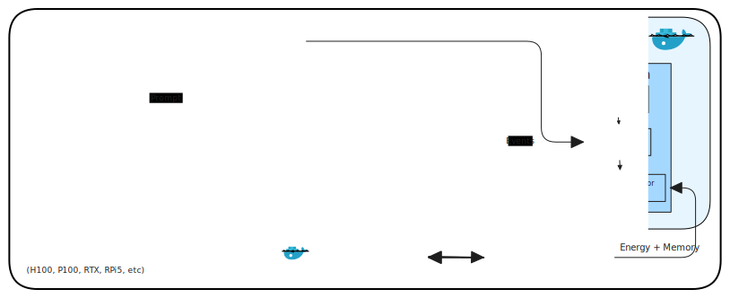

# OpenMCP: a fully open-source and self-hosted testbed for MCP-enabled CUA benchmarking
  [](https://trovi.chameleoncloud.org/dashboard/artifacts/31fc62a4-1996-4719-957e-4c1b4e47b1b6) [](https://huggingface.co/datasets/aguleon/OpenMCP_dataset_v1)

OpenMCP is an open-source benchmarking framework designed for evaluating MCP-enabled **Computer-Using Agents (CUAs)**. It supports agents that interact with software applications via **GUI**, **API (Model Context Protocol – MCP)**, or **Hybrid** methods.


**Table of Contents**  *generated with [DocToc](https://github.com/thlorenz/doctoc)*
<!-- START doctoc generated TOC please keep comment here to allow auto update -->
<!-- DON'T EDIT THIS SECTION, INSTEAD RE-RUN doctoc TO UPDATE -->

- [Key Features](#key-features)
- [Overview](#overview)
- [Prerequisites](#prerequisites)
- [Quickstart](#quickstart)
- [0. Cloning the repo](#0-cloning-the-repo)
- [1. Check and update the test configuration](#1-check-and-update-the-test-configuration)
- [2. Start the Workspace and run benchmark tests](#2-start-the-workspace-and-run-benchmark-tests)
  - [What starts automatically:](#what-starts-automatically)
- [3. Monitor Headless Runs](#3-monitor-headless-runs)
- [Running Tests](#running-tests)
- [Documentation](#documentation)
- [Project Structure](#project-structure)
- [Quick References](#quick-references)
  - [Configuration Reference](#configuration-reference)
    - [Docker & Display](#docker--display)
    - [LLM Provider](#llm-provider)
    - [OpenAI-Compatible API](#openai-compatible-api)
    - [Execution Settings](#execution-settings)
    - [LLM Runtime Tuning](#llm-runtime-tuning)
    - [Ollama Server](#ollama-server)
  - [Task Counts](#task-counts)
  - [Port Mapping](#port-mapping)
- [License](#license)

<!-- END doctoc generated TOC please keep comment here to allow auto update -->

---

## Key Features

* **Host Your Own Models**: Run any Ollama-compatible model locally. Benchmark open-source LLMs with full control over model selection and configuration.

* **In-depth Metrics Collection**: Collect detailed agent and system metrics such as tool calls, confidence scores, loop detection, GPU/CPU usage, memory, and energy consumption for deeper benchmarking and analysis.

* **Black-Box and White-Box Evaluation**:
  * Black-box evaluators inspect filesystem outputs for success/failure
  * White-box evaluators hook into application internals via WebSocket/IPC for precise, reproducible verification

* **GUI, API, and Hybrid Interaction**: Integrated MCP (Model Context Protocol) support enables mixed-mode control, letting agents seamlessly switch between API calls and GUI interactions as needed.

* **Comprehensive Task Suite**: 30+ tasks across open source as well as proprietary applications (VSCode, Obsidian).

* **Easy Setup & Multi-Model Testing**: Get started quickly with a single script that handles Docker setup, application installation, and benchmark execution. Easily configure and run tests across multiple models and applications.

* **Interactive Debugging via Streamlit & noVNC**: Watch agents in action through the noVNC desktop view while interacting via the Streamlit chat interface. Perfect for human-in-the-loop evaluation, debugging, and demonstrations.

* **Bring Your Own Cloud**: Deploy on any cloud infrastructure.

* **Extensible Framework**: Add new tasks, applications, or agents through a clear folder structure and well-defined interfaces. See the [onboarding guide](./onboard-application.md) to get started.

---

## Overview


---

## Prerequisites

* Docker
* Nvidia Container Toolkit (For Docker container to access GPU resource)
- For the instance resource setup allocation in ChameleonCloud, please follow [this notebook](https://github.com/AguLeon/MCP_SLM_Project/blob/main/start_run_instance.ipynb) in ChameleonCloud Trovi Experiment

---
## Quickstart

Kick off OpenMCP environment with the essentials below. Each step explains what the command accomplishes so the system can be run with confidence. These can be done directly after cloning the repository and its sub-modules.

## 0. Cloning the repo
```bash
git clone https://github.com/AguLeon/MCPWorld
cd MCPWorld
git submodule update --init PC-Canary
```

We also want to clone downstream linked repositories to the open-source apps we use (e.g. VS Code):
```bash
git submodule update --init --recursive
```

## 1. Check and update the test configuration
Check the configuration file in `./scripts/config.cfg` for all the experiments configuration. See the [Configuration Reference](#configuration-reference) for all available options.
Once you have the configuration set, you can move to the next step.

## 2. Start the Workspace and run benchmark tests

Bring up the container stack using the `entrypoint,sh` script. This boots the desktop environment, VNC/noVNC services, Ollama, and prepares the shared workspace volume.

```bash
cd ~/MCPWorld
./scripts/entrypoint.sh <infrastructure_tag>

# Example:
./scripts/entrypoint.sh H100x1
```

The entrypoint script will:
- Start the Docker containers (with GPU support if available)
- Prompt you to install applications
- Prompts the user to run the benchmark suite

**Options:**
- `--rebuild`: Force rebuild of Docker images even if they exist
  ```bash
  ./scripts/entrypoint.sh --rebuild H100x1
  ```

- SUDO password for `mcpworld` environment : `123`

### What starts automatically:
The entrypoint script always launches 2 containers; `mcpworld` and `ollama`:
- In `mcpworld` container, following are run automatically:
    - TurboVNC (display `:4`),
    - The noVNC web proxy (port `6080`),
    - Streamlit to demo LLM and agent's action (port 8501)
    - All the packages specified in `computer-use-demo/computer_use_demo/requirements.txt`
- The `ollama` container runs a Ollama server

NOTE:
To go inside the docker container environment, you can write the following command:
```bash
docker exec -it <container-name> /bin/bash
```
This starts a container's bash session.

## 3. Monitor Headless Runs
- The evaluator logs everything under the session folder you specify (default `logs_computer_use_eval/`). Tail the live log and inspect the saved metrics afterward:

```bash
# Watch the evaluator log as it streams (replace paths with your session)
tail -f logs_computer_use_eval/<app-name>_runs/<model-name>_<infrastructure>/<task-id>_<task_name>_evaluator/*.log
```

```bash
# After the run finishes, review the computed metrics and events
cat logs_computer_use_eval/<app-name>_runs/<model-name>_<infrastructure>/result_<timestamp>_<model>_<infrastructure>_<task-id>_<task_name>/*.json
```

- `tail -f …_evaluator.log`: Follow real-time output from the evaluator—tool calls, key-step hits, and final TASK_END status.
- `cat result_….json`: Dump the ResultCollector snapshot (success flag, duration, key-step coverage, token/tool stats). Load it into `jq`/Python for deeper analysis.

---

## Running Tests
After the environment, is created, necessary services are created, and the apps to be tested are installed, now is time to run the test!
There are 2 main ways it can be done:
- From the host machine
    - Running multiple tests across LLM models (`./scripts/run_multi_model_benchmark.sh`)
- From the docker container (`mcpworld`)
    - Running multiple tests for single LLM Model (`/workspace/scripts/run_tasks_range.sh`)
```bash
./scripts/run_tasks_range.sh [app-name] [start-task] [end-task]

# E.g. To run a range
./scripts/run_tasks_range.sh [app-name] 1 10  # Will run tasks 1 to 10 for [app-test]

# E.g. To just run one task
./scripts/run_tasks_range.sh [app-name] 2 2  # Will only run task 2 from [app-name] test tasks

```


<!-- - Running individual tests for single LLM models -->
<!--     ```bash -->
<!--     python3 computer-use-demo/run_pure_computer_use_with_eval.py \ -->
<!--     --provider "$PROVIDER" \ -->
<!--     --openai_api_key dummy \ -->
<!--     --openai_base_url "$OPENAI_BASE_URL" \ -->
<!--     --openai_endpoint "$OPENAI_ENDPOINT" \ -->
<!--     --model "$MODEL" \ -->
<!--     --task_id "$TASK_ID" \ -->
<!--     --log_dir "$RUN_LOG_DIR" \ -->
<!--     --exec_mode "$EXEC_MODE" \ -->
<!--     --timeout "$TASK_TIMEOUT" \ -->
<!--     --api_key "$ANTHROPIC_API_KEY" -->
<!--     ``` -->
<!-- - You can use the batch tests to run the entire benchmark suite while the individual tests is useful for debugging and testing various aspect of this project -->

---

## Documentation

* **Framework Overview**: Please refer to the [framework overview](./framework.md)
* **Test Runner**: Please refer to the [test scripts details](./scripts/README.md)
* **Onboaring New Applications and Test**: Please refer to the [onboading guide](./onboard-application.md)

---

## Project Structure
```
MCPWorld/
├── computer-use-demo/           # Agent implementation
│   ├── computer_use_demo/
│   │   ├── loop.py              # Main sampling loop
│   │   ├── providers/           # LLM provider adapters
│   │   ├── tools/               # Computer use tools
│   │   ├── mcpclient.py         # MCP client
│   │   └── streamlit.py         # UI
│   ├── image/                   # Docker image assets & startup scripts
│   ├── tests/                   # Unit tests
│   └── run_pure_computer_use_with_eval.py  # Headless runner
├── PC-Canary/                   # Evaluation framework (submodule)
│   ├── evaluator/
│   │   ├── core/
│   │   │   ├── base_evaluator.py
│   │   │   ├── result_collector.py
│   │   │   └── metrics/
│   │   └── utils/
│   ├── tests/
│   │   ├── tasks/               # Task definitions (vscode: 25, obsidian: 12)
│   │   └── context_data/        # Pre-configured app states
│   └── apps/                    # Application source repositories
├── docker/                      # Container configuration
│   ├── docker-compose.yml       # Multi-container setup (mcpworld + ollama)
│   ├── Dockerfile
│   ├── start_service.sh
│   └── apps_install_scripts/    # App installation scripts
├── scripts/                     # Batch execution & metrics collection
    ├── entrypoint.sh            # Main entry point for OpenMCP setup
    ├── config.cfg               # Batch run configuration
    ├── models.cfg               # Models to benchmark
    ├── run_tasks_range.sh       # Generic task range runner
    ├── run_vscode_range.sh      # VSCode batch runner
    ├── run_obsidian_range.sh    # Obsidian batch runner
    ├── run_vscode_then_obsidian_range.sh  # Sequential runner
    ├── run_multi_model_benchmark.sh       # Multi-model automation
    ├── monitor_gpu.py           # GPU metrics monitoring
    ├── kill_all_benchmarks.sh   # Cleanup utility
    └── collect_metrics.py       # Results aggregation utility
```


---

## Quick References

### Configuration Reference

All settings below are defined in `./scripts/config.cfg`.

#### Docker & Display

| Variable         | Description                        | Default      |
|------------------|------------------------------------|--------------|
| `CONTAINER_NAME` | Name of the main Docker container  | `openmcp`   |
| `HEIGHT`         | Screen/display height (pixels)     | `1000`       |
| `WIDTH`          | Screen/display width (pixels)      | `1000`       |

#### LLM Provider

| Variable            | Description                                        | Default                           |
|---------------------|----------------------------------------------------|-----------------------------------|
| `PROVIDER`          | LLM backend to use (`openai` or `anthropic`)       | `openai`                          |
| `MODELS`            | List of models to cycle through in multi-model runs | *(see config.cfg)*               |
| `ANTHROPIC_API_KEY` | Anthropic API key (required when `PROVIDER=anthropic`) | `dummy_api_key`               |

#### OpenAI-Compatible API

| Variable           | Description                                       | Default                              |
|--------------------|---------------------------------------------------|--------------------------------------|
| `OPENAI_BASE_URL`  | Base URL of the OpenAI-compatible API endpoint    | `http://host.docker.internal:11434`  |
| `OPENAI_ENDPOINT`  | API path for chat completions                     | `/v1/chat/completions`               |

#### Execution Settings

| Variable        | Description                                               | Default  |
|-----------------|-----------------------------------------------------------|----------|
| `EXEC_MODE`     | Interaction mode: `mixed`, `gui`, or `api`                | `mixed`  |
| `TASK_TIMEOUT`  | Per-task execution timeout (seconds)                      | `600`    |
| `TOTAL_TIMEOUT` | Total evaluator runtime limit (seconds)                   | `2000`   |
| `MAX_LLM_CALLS` | Max LLM calls per task (leave blank for unlimited)        | `30`     |

#### LLM Runtime Tuning

| Variable          | Description                                                    | Default |
|-------------------|----------------------------------------------------------------|---------|
| `LLM_TEMPERATURE` | Sampling temperature — higher = more creative, lower = more deterministic | `0.7`   |

#### Ollama Server

| Variable                  | Description                                          | Default                        |
|---------------------------|------------------------------------------------------|--------------------------------|
| `OLLAMA_DEBUG`            | Enable debug logging (`1` = on, `0` = off)           | `0`                            |
| `OLLAMA_HOST`             | Ollama server bind address                           | `127.0.0.1:11434`              |
| `OLLAMA_CONTEXT_LENGTH`   | Default model context window size (tokens)           | `4096`                         |
| `OLLAMA_KEEP_ALIVE`       | How long loaded models stay in memory                | `24h`                          |
| `OLLAMA_MAX_QUEUE`        | Maximum number of queued inference requests          | `512`                          |
| `OLLAMA_MAX_LOADED_MODELS`| Maximum number of models loaded per GPU              | `1`                            |
| `OLLAMA_MODELS`           | Path to the Ollama models directory                  | `/var/lib/ollama/models`       |
| `OLLAMA_NUM_PARALLEL`     | Max parallel inference requests                      | `1`                            |
| `OLLAMA_NOPRUNE`          | Disable model blob pruning on startup (`1` = disable)| `0`                            |
| `OLLAMA_ORIGINS`          | Allowed CORS origins                                 | `*`                            |
| `OLLAMA_SCHED_SPREAD`     | Spread model load across all available GPUs          | `0`                            |
| `OLLAMA_FLASH_ATTENTION`  | Enable Flash Attention for faster inference          | `1`                            |
| `OLLAMA_KV_CACHE_TYPE`    | KV cache quantization type                           | `f16`                          |
| `OLLAMA_GPU_OVERHEAD`     | Reserved VRAM per GPU (bytes)                        | `0`                            |
| `OLLAMA_LOAD_TIMEOUT`     | Timeout for loading a model into memory              | `5m`                           |

---

### Task Counts
| Application | Task Count      |
|------------|-----------------|
| VSCode     | 25 tasks        |
| Obsidian   | 12 tasks        |
| Telegram   | Multiple tasks  |

### Port Mapping
| Port  | Service                 |
|-------|--------------------------|
| 5900  | VNC Server (legacy)      |
| 5904  | VNC Server (active)      |
| 6080  | noVNC Web Proxy          |
| 8501  | Streamlit UI             |
| 11434 | Ollama API               |

---

<!-- ## 📖 Citation

```bibtex
@inproceedings{MCPWorld2025,
  title     = {MCPWorld: A Multi-Modal Test Platform for Computer-Using Agents},
  author    = {YourName and Author1 and Author2},
  booktitle = {NeurIPS 2025},
  year      = {2025}
}
``` -->

<!-- --- -->

## License

Released under the MIT License.

